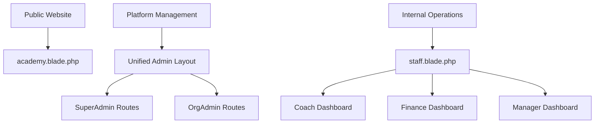

# Architectural Audit Report - Football Academy Management Platform

## Step 1: Comprehensive Codebase Audit Summary

### 1.1 Layout Files Identified

| File Path | Purpose | Status |
|-----------|---------|--------|
| `resources/views/layouts/academy.blade.php` | Public website layout | Active |
| `resources/views/layouts/admin.blade.php` | Admin panel layout | Active |
| `resources/views/layouts/app.blade.php` | Base app layout | Active |
| `resources/views/layouts/dashboard-base.blade.php` | Legacy dashboard layout | **DEPRECATED** |
| `resources/views/layouts/dashboard.blade.php` | New unified dashboard layout | Active |
| `resources/views/layouts/staff.blade.php` | Staff panel layout | Active |
| `resources/views/layouts/navigation.blade.php` | Shared navigation component | Active |

**Total Layouts: 7**

### 1.2 Dashboard Files Identified

| Directory | Dashboards | Purpose |
|-----------|------------|---------|
| `resources/views/dashboard/` | org-admin, parent, player, staff, super-admin, trial | Simplified role-based dashboards |
| `resources/views/admin/` | Full admin panel with dashboard | Complete admin functionality |
| `resources/views/super-admin/` | Platform management dashboard | Super admin functionality |
| `resources/views/staff/` | coach, finance, manager, media, welfare | Staff role-specific dashboards |

### 1.3 Middleware Identified

| Middleware | Purpose |
|------------|---------|
| `AdminMiddleware.php` | Checks for admin role |
| `AdminSession.php` | Session management for admins |
| `CheckFeature.php` | Feature flag checking |
| `CheckSubscriptionAccess.php` | Subscription validation |
| `CheckSuperAdmin.php` | Super admin role check |
| `CheckUserStatus.php` | User status validation |
| `OrganizationScopeMiddleware.php` | Tenant isolation |
| `PartnerMiddleware.php` | Partner role check |
| `PermissionMiddleware.php` | Permission-based access |
| `PlayerMiddleware.php` | Player role check |
| `RoleMiddleware.php` | Generic role check |
| `TenantScope.php` | Multi-tenant scoping |

---

## Step 2: Current Structure Validation - Issues Identified

### 2.1 CRITICAL: Route Conflicts Found

| Conflict | Location | Issue |
|----------|----------|-------|
| **Super Admin Dashboard** | `routes/web.php:220` and `:947` | Duplicate route definitions |
| **Admin Dashboard** | `routes/web.php:224` and `:286` | Duplicate route definitions |
| **Admin Middleware** | Mixed `admin` vs `role:admin` | Inconsistent middleware usage |

### 2.2 Layout Redundancy

**Problem:** Multiple layouts serve similar purposes:
- `dashboard.blade.php` - New unified layout
- `dashboard-base.blade.php` - Legacy layout (still in use?)
- `admin.blade.php` - Admin-specific layout
- `staff.blade.php` - Staff-specific layout

**Assessment:** Overlap exists but each has distinct responsibilities. However, `dashboard-base.blade.php` appears to be legacy code that may no longer be needed.

### 2.3 Dashboard Duplication

**Critical Finding:** Dashboard logic is duplicated across multiple locations:

1. **Admin Dashboard** - Exists in TWO places:
   - `resources/views/admin/dashboard/index.blade.php`
   - `resources/views/dashboard/super-admin/index.blade.php`

2. **Staff Dashboards** - Exist in THREE places:
   - `resources/views/staff/*/dashboard.blade.php` (specialized)
   - `resources/views/dashboard/staff/index.blade.php` (general)
   - Within `resources/views/admin/` (integrated)

---

## Step 3: Proposed Structure Evaluation

### 3.1 Evaluation of Proposed Three-Layout Structure

The proposed simplification (Academy, SuperAdmin, Staff layouts) **has merit but needs refinement**:

| Proposed Layout | Recommendation | Notes |
|-----------------|----------------|-------|
| Academy Layout | **KEEP** `academy.blade.php` | Public website - works well |
| SuperAdmin Layout | **MERGE** admin + superadmin | Single platform management layout |
| Staff Layout | **KEEP** `staff.blade.php` | Works for internal operations |

### 3.2 Recommended Architecture



---

## Step 4: Dashboard Structure Analysis

### 4.1 Current Dashboard Implementations

| Role | Dashboard Location | Status |
|------|-------------------|--------|
| Super Admin | `views/super-admin/dashboard.blade.php` | Separate |
| Admin | `views/admin/dashboard/index.blade.php` | Separate |
| Org Admin | `views/dashboard/org-admin/index.blade.php` | Simplified |
| Staff | Multiple locations | **DUPLICATED** |
| Player | `views/dashboard/player/index.blade.php` | Separate |
| Parent | `views/dashboard/parent/index.blade.php` | Separate |

### 4.2 Recommendation

**Consolidate to a Unified Dashboard with Role-Based Modules:**

1. Create a single `dashboard/index.blade.php` that loads role-specific widgets
2. Use `@can` directives to show/hide modules based on permissions
3. Keep specialized views for complex modules (e.g., finance analytics)

**Benefits:**
- Single point of entry for all authenticated users
- Easier maintenance
- Consistent UX
- Role-specific customization through modules

---

## Step 5: Authentication and Role Logic Preservation

### 5.1 Current Role Hierarchy

```
super-admin (Full platform control)
├── org-admin (Organization management)
├── admin (General admin operations)
│   ├── head-coach
│   ├── safeguarding-officer
│   ├── finance-officer
│   └── media-officer
├── partner_staff
│   ├── coach
│   ├── assistant-coach
│   └── team-manager
└── player
    ├── player
    └── parent
```

### 5.2 Authentication Middleware Flow

Current middleware chain (in order):
1. `web` - Web session
2. `auth` - Authentication check
3. `CheckUserStatus` - Active status
4. `admin` or `role:xxx` - Role check

### 5.3 Preservation Requirements

**MUST NOT CHANGE:**
- `user_type` field in User model
- Role definitions in database
- Permission checks throughout codebase
- Tenant isolation logic in `OrganizationScopeMiddleware`
- Authentication middleware chain

---

## Step 6: Navigation Architecture Audit

### 6.1 Current Navigation Implementation

**Problem:** Navigation is scattered across multiple locations:

| Location | Navigation Type |
|----------|-----------------|
| `layouts/navigation.blade.php` | Shared component |
| `layouts/admin.blade.php` | Hardcoded admin nav |
| `layouts/staff.blade.php` | Hardcoded staff nav |
| `layouts/academy.blade.php` | Website nav |

### 6.2 Recommendation

**Create Role-Based Navigation Config:**

```php
// config/navigation.php
return [
    'super-admin' => [
        ['title' => 'Dashboard', 'route' => 'super-admin.dashboard', 'icon' => 'fa-home'],
        ['title' => 'Organizations', 'route' => 'super-admin.organizations', 'icon' => 'fa-building'],
        // ...
    ],
    'admin' => [
        ['title' => 'Dashboard', 'route' => 'admin.dashboard', 'icon' => 'fa-home'],
        ['title' => 'Players', 'route' => 'admin.players', 'icon' => 'fa-users'],
        // ...
    ],
    // ...
];
```

---

## Step 7: Conflicts Identified Summary

| # | Conflict Type | Location | Severity |
|---|---------------|----------|----------|
| 1 | Route Duplication | `routes/web.php:220` vs `:947` | CRITICAL |
| 2 | Route Duplication | `routes/web.php:224` vs `:286` | CRITICAL |
| 3 | Middleware Inconsistency | Mixed `admin` and `role:admin` | HIGH |
| 4 | Dashboard Duplication | Multiple staff dashboards | MEDIUM |
| 5 | Layout Overlap | `dashboard-base.blade.php` usage unclear | LOW |
| 6 | Navigation Scattered | Hardcoded in 4+ layouts | MEDIUM |

---

## Step 8: Clean Architecture Recommendation

### 8.1 Proposed Layout Structure

```
resources/views/
├── layouts/
│   ├── academy.blade.php      (Public website - KEEP)
│   ├── admin.blade.php        (Unified admin - MERGE admin+superadmin)
│   ├── staff.blade.php        (Internal ops - KEEP)
│   └── navigation/            (NEW: Centralized nav configs)
│       ├── admin.php
│       ├── staff.php
│       └── academy.php
├── dashboard/
│   └── index.blade.php        (UNIFIED: Role-based modules)
├── components/
│   ├── dashboard/             (NEW: Modular dashboard widgets)
│   └── navigation/            (NEW: Dynamic nav)
```

### 8.2 Proposed Dashboard Structure

```
resources/views/dashboard/
├── index.blade.php           (Main unified dashboard)
├── modules/
│   ├── stats-overview.php    (Shared statistics)
│   ├── quick-actions.php     (Permission-based actions)
│   ├── recent-activity.php   (Activity feed)
│   └── alerts.php            (System alerts)
```

### 8.3 Refactoring Roadmap

1. **Phase 1: Fix Critical Issues**
   - Remove duplicate routes in web.php
   - Standardize middleware usage
   - Fix syntax error in admin dashboard

2. **Phase 2: Consolidate Layouts**
   - Merge admin.blade.php and superadmin elements
   - Deprecate dashboard-base.blade.php

3. **Phase 3: Unified Dashboard**
   - Create modular dashboard structure
   - Implement role-based widget loading

4. **Phase 4: Navigation Centralization**
   - Create navigation config files
   - Implement dynamic menu rendering

---

## Step 9: Immediate Actions Required

### 9.1 Critical Fixes (Before Continuing)

1. **Fix Route Conflicts** - Remove duplicate routes in web.php
2. **Fix Syntax Error** - Line 329 in admin/dashboard/index.blade.php
3. **Standardize Middleware** - Use consistent role middleware

### 9.2 Files to Modify

| Action | File | Reason |
|--------|------|--------|
| DELETE | `routes/web.php` lines 946-947 | Duplicate superadmin route |
| DELETE | `routes/web.php` lines 285-286 | Duplicate admin route |
| FIX | `resources/views/admin/dashboard/index.blade.php` | Syntax error |
| MERGE | `layouts/admin.blade.php` + superadmin nav | Unify platform management |

---

## Summary

This platform has significant architectural issues including:
- **Route conflicts** causing potential 500 errors
- **Dashboard duplication** across multiple locations
- **Navigation scattered** in multiple hardcoded locations
- **Middleware inconsistency** in role checking

The proposed three-layout structure is sound but should be implemented incrementally, starting with fixing the critical route conflicts and syntax errors.
